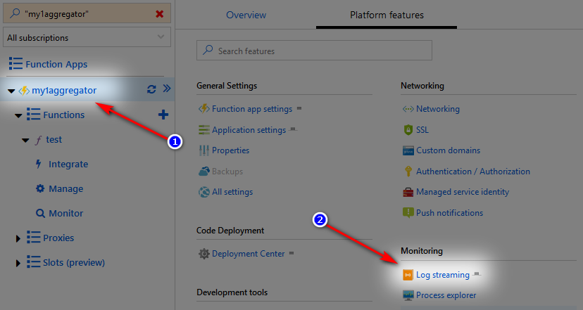

# aggregator-cli

This is the successor to TFS Aggregator.
The current Server Plugin version (2.x) will be maintained to support TFS.
The Web Service flavor will be discontinued in favor of this (its deployment and configuration was too complex for most users).

The main scenario for Aggregator (3.x) is supporting VSTS and the cloud scenario. It will work for TFS as long as it is reachable from Internet.

> **This is an early version (alpha)**: we might change verbs and rule language before the final release!

## Major features

- use of new REST API
- simple deployment via CLI tool
- similar model for Rules

## Planned features

- Support for Deployment Slots for blue/green-style deployments
- OAuth support to avoid maintain access tokens
- Additional VSTS events
- Additional VSTS objects

## How it works

An Aggregator Instance is an Azure Function Application in its own Resource Group,
sharing the same VSTS credential. You can have only one Application per Resource Group.
If the Resource Group does not exists, Aggregator will try to create it.
*Note*: The Instance name must be **unique** amongst all Aggregator Instances in Azure!

Each Aggregator Rule becomes an Azure Function in the above instance.
The Rule code is parsed and run on-the-spot using Roslyn.
To work, it uses an Aggregator Runtime.
Aggregator checks its latest GitHub Release to ensure that Aggregator Runtime is up-to-date before uploading the function.
*Note*: We use [Azure Functions Runtime](https://docs.microsoft.com/en-us/azure/azure-functions/functions-versions) 2.0 for C# which is still in Preview.

An Aggregator Mapping is a VSTS Service Hook for a specific work item event that invokes an Aggregator Rule i.e. the Azure Function hosting the Rule code. VSTS saves the Azure Function Key in the Service Hook configuration.

You can deploy the same Rule in many Instances or map the same VSTS event to many Rules: it is up how to organize.

## Authentication

You must instruct Aggregator which credential to use.
To do this, run the `login.azure` and `login.vsts` commands.

To create the credentials, you need an Azure Service Principal and a VSTS Personal Access Token.

These documents will guide you
* [Use portal to create an Azure Active Directory application and service principal that can access resources](https://docs.microsoft.com/en-us/azure/azure-resource-manager/resource-group-create-service-principal-portal)        
* [Create personal access tokens to authenticate access](https://docs.microsoft.com/en-us/vsts/organizations/accounts/use-personal-access-tokens-to-authenticate?view=vsts#create-personal-access-tokens-to-authenticate-access).

Logon credentials are stored locally and expire after 2 hours.

The PAT is stored in the Azure Function settings: **whoever has access to the Resource Group can read it!**

The Service Principal must have Contributor permission to the Azure Subscription.
In alternative, pre-create the `aggregator-` Resource Group in Azure and give the service account Contributor permission to the Resource Group.
The `instance` parameter prefixes `aggregator-` to identify the Resource Group.

## Usage

Download and unzip the latest CLI.zip file from [Releases](https://github.com/tfsaggregator/aggregator-cli/releases).
It requires [.Net Core 2.1](https://www.microsoft.com/net/download).
To run Aggregator use
`dotnet aggregator-cli.dll` followed by the verb and the options.

### Verbs

 Verb               | Use
--------------------|----------------------------------------
logon.azure         | Logon into Azure.
logon.vsts          | Logon into Visual Studio Team Services.
list.instances      | Lists Aggregator instances.
install.instance    | Creates a new Aggregator instance in Azure.
uninstall.instance  | Destroy an Aggregator instance in Azure.
list.rules          | List the rule in existing Aggregator instance in Azure.
add.rule            | Add a rule to existing Aggregator instance in Azure.
remove.rule         | Remove a rule from existing Aggregator instance in Azure.
configure.rule      | Change a rule configuration and code.
list.mappings       | Lists mappings from existing VSTS Projects to Aggregator Rules.
map.rule            | Maps an Aggregator Rule to existing VSTS Projects.
unmap.rule          | Unmaps an Aggregator Rule from a VSTS Project.
help                | Display more information on a specific command.
version             | Display version information.

## Examples

You can see a few Command examples in [Sample Aggregator CLI usage](doc/command-examples.md).
You can see a few Rule examples in [Rule Examples](doc/rule-examples.md).

## Troubleshooting

### View live Aggregator log messages

In Azure Portal, open the Resource Group hosting the Instance (`aggregator-` followed by name of instance).
Open the App Service hosting the Instance (instance name followed by `aggregator`).
Switch to the **Platform features** tab and click on _Log streaming_ like in the picture.

