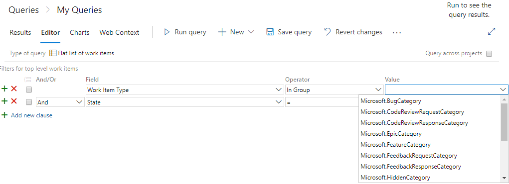
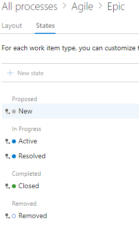
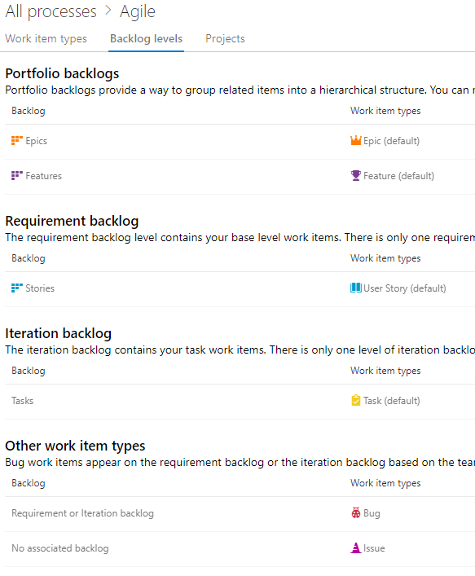

# Directives

The directives must appear in the first lines of a Rule file.
They are parsed by Aggregator and removed before compiling the code.

## language directive
`.lang=C#`
`.language=Csharp`

Currently the only supported language is C#. You can use the `.lang` directive to specify the programming language used by the rule.

## reference directive
Loads the specified assembly in the Rule execution context

Example
`.reference=System.Xml.XDocument`

## import directive
Equivalent to C# namespace
`.import=System.Collections.Generic`


# WorkItem Object
The initial WorkItem object, the one which triggered the rule, is contained in the `self` variable.


## Revisions
Navigate to previous versions of the work item.

`WorkItem PreviousRevision`
Returns a read-only copy of the previous revision of this work item.

`IEnumerable<WorkItem> Revisions`
Returns a read-only copy of all revisions of this work item.


## Relations
Navigate to related work items.

`IEnumerable<WorkItemRelation> RelationLinks`
Returns all relations as `WorkItemRelation`.

`WorkItemRelationCollection Relations`
Returns a collection to navigate and modify relations.

`IEnumerable<WorkItemRelation> ChildrenLinks`
Returns the children links in Hierarchy relation, i.e. `System.LinkTypes.Hierarchy-Forward`.

`IEnumerable<WorkItem> Children`
Returns the children work items in Hierarchy relation, i.e. `System.LinkTypes.Hierarchy-Forward`. E.g. a _Task_ can be a child of a _User Story_.

`WorkItemRelation ParentLink`
Returns the parent link in Hierarchy relation, i.e. `System.LinkTypes.Hierarchy-Reverse`.

`WorkItem Parent`
Returns the parent work item in Hierarchy relation, i.e. `System.LinkTypes.Hierarchy-Reverse`. E.g. a _User Story_ is the parent of a _Task_.


## Links
Navigate links to non-work-item objects.

`IEnumerable<WorkItemRelation> RelatedLinks`
Returns related work items as `WorkItemRelation`.

`IEnumerable<WorkItemRelation> Hyperlinks`
Returns hyperlinks.

`int ExternalLinkCount`
Returns the number of links to external objects.

`int HyperLinkCount`
Returns the number of hyperlinks.

`int RelatedLinkCount`
Returns the number of related work items.


## Core Fields helpers
Data fields of the work item. See [Work item field index](https://docs.microsoft.com/en-us/azure/devops/boards/work-items/guidance/work-item-field?view=vsts) for a complete description.

`int AreaId`
The unique ID of the area to which this work item is assigned.

`string AreaPath`
Groups work items into product feature or team areas. The area must be a valid node in the project hierarchy.

`IdentityRef AssignedTo`
The name of the team member who currently owns the work item.

`IdentityRef AuthorizedAs`

`DateTime? AuthorizedDate`

`IdentityRef ChangedBy`
The name of the team member who modified the work item most recently. 

`DateTime? ChangedDate`
The date and time when a work item was modified.

`IdentityRef CreatedBy`
The name of the team member who created the work item.

`DateTime? CreatedDate`
The date and time when a work item was created.

`string Description`
Use this field to provide indepth information about a work item.

`string History`
The record of changes that were made to the work item after it was created.

`WorkItemId<int> Id` Read-only.
The unique identifier that is assigned to a work item.
 Negative when `IsNew` equals `true`.

`int IterationId`
The unique ID of the iteration to which this work item is assigned.

`string IterationPath`
Groups work items by named sprints or time periods. The iteration must be a valid node in the project hierarchy.

`string Reason`
The reason why the work item is in the current state.

`int Rev` Read-only.
A number that is assigned to the historical revision of a work item. 

`DateTime? RevisedDate`
The date and time stamp when a test case or shared step is revised.

`string State`
The current state of the work item.

`string Tags`
A tag corresponds to a one or two keyword phrase that you define and that supports your needs to filter a backlog or query, or define a query. 

`string TeamProject`
The project to which a work item belongs.

`string Title`
A short description that summarizes what the work item is and helps team members distinguish it from other work items in a list.

`string Url` Read-only.

`double Watermark` Read-only.
A system managed field (not editable) that increments with changes made to a work item.

`string WorkItemType` Read-only.
The name of the work item type.


## Fields
`object this[string field]`
Read-write access to non-core fields.
Must use reference name, like _System.Title_, instead of language specific, like _Titolo_, _Titel_ or _Title_.
> Careful: Reference name is **case-sensitive**.

`public T GetFieldValue<T>(string field, T defaultValue)`
Typed read-only access to non-core fields. The value is converted to the requested type, if the field nas no value, `defaultValue` is returned. Example:
```
var customField1 = self.GetFieldValue<string>("MyOrg.StringCustomField1", "MyDefault");
var customField2 = self.GetFieldValue<decimal>("MyOrg.NumericCustomField2", 3.0m);
```


## Status properties
`bool IsDeleted` Read-only, returns `true` if the work item is currently located
in recycle bin.

`bool IsReadOnly` Read-only, returns `true` if work item cannot be modified.

`bool IsNew` Read-only, returns `true` if work item is new.

`bool IsDirty` Read-only, returns `true` if work item changed after retrieval.


## Attachments
`int AttachedFileCount`
Returns the number of attached files.


# WorkItem Changes
If the rule was triggered by the `workitem.updated` event, the changes 
which were made to the WorkItem object, are contained in the `selfChanges` variable.

## Fields
Data fields of the work item update. 

`int Id` Read-only.
The unique identifier of the _Update_.
Each change leads to an increased update id, but not necessarily to an updated revision number.
Changing only relations, without changing any other information does not increase revision number.

`int WorkItemId` Read-only.
The unique identifier of the _work item_.

`int Rev` Read-only.
The revision number of work item update.

`IdentityRef RevisedBy` Read-only.
The Identity of the team member who updated the work item. 

`DateTime RevisedDate` Read-only.
The date and time when the work item updates revision date.

`WorkItemFieldUpdate Fields[string field]` Read-only. 
Access to the list of updated fields.
Must use reference name, like _System.Title_, instead of language specific, like _Titolo_, _Titel_ or _Title_.

`WorkItemRelationUpdates Relations` Read-only. 
Returns the information about updated relations

## WorkItemFieldUpdate
Updated Field Information containing old and new value.

`object OldValue` Read-only. 
Returns the previous value of the field or `null`

`object NewValue` Read-only. 
Returns the new value of the field


## WorkItemRelationUpdates
Groups the changes of the relations

`ICollection<WorkItemRelation> Added` Read-only. 
Returns the added relations as `WorkItemRelation`.

`ICollection<WorkItemRelation> Removed` Read-only. 
Returns the removed relations as `WorkItemRelation`.

`ICollection<WorkItemRelation> Updated` Read-only. 
Returns the updated relations as `WorkItemRelation`.


# WorkItemStore Object
The WorkItemStore object allows retrieval, creation and removal of work items.
This object is contained in the `store` variable.

`WorkItem GetWorkItem(int id)`
Returns a single work item.

`WorkItem GetWorkItem(WorkItemRelation item)`
Returns a single work item following the relation.

`IList<WorkItem> GetWorkItems(IEnumerable<int> ids)`
Returns a list of work items.

`IList<WorkItem> GetWorkItems(IEnumerable<WorkItemRelation> collection)`
Returns a list of work items following the relation.

`WorkItem NewWorkItem(string workItemType)`
Returns a new work item with a temporary Id. The work item is created when the rules ends.
`IsNew` returns `true`.

`bool DeleteWorkItem(WorkItem workItem)`
Deletes the given work item and returns `true` if work item can be deleted.

`bool RestoreWorkItem(WorkItem workItem)`
Restores the given work item from recycle bin and returns `true` if work item 
can be restored.

`IEnumerable<WorkItemTypeCategory> GetWorkItemCategories()`
Returns a list of work item category names with the mapped work item types, see 
[WorkItemTypeCategory](#workitemtypecategory)


`IEnumerable<BacklogWorkItemTypeStates> GetBacklogWorkItemTypesAndStates()`
Returns a list of backlog work item types with their backlog level information and the state to state 
category mappings, see [BacklogWorkItemTypeStates](#backlogworkitemtypestates)


# WorkItemTypeCategory
Work item categories group work items types together, you can see a list of
available categories in query editor:



`string ReferenceName`
Category ReferenceName, e.g. "Microsoft.EpicCategory"

`string Name`
Category Display Name, e.g. "Epic Category"

`IEnumerable<string> WorkItemTypeNames`
WorkItemType Names in this Category, e.g. "Epic" or "Test Plan"

# BacklogWorkItemTypeStates
A work item type with its Backlog Level Information and the 
work item State to State Category mapping.
The mappings can be seen per work item template in the states configuration, e.g. "Epic":




`string Name`
WorkItem Name, e.g. "Epic"

`BacklogInfo Backlog`
[Backlog Level Information](#backloginfo) for this WorkItem Type.

`IDictionary<string, string[]> StateCategoryStateNames`
State Category (Meta-State) to WorkItem state name mapping.

Example: mapping for the WorkItem Type Epic of default Agile Process:
 - "Proposed"   = "New"
 - "InProgress" = "Active", "Resolved"
 - "Resolved"   = \<empty>
 - "Complete"   = "Closed"
 - "Removed"    = "Removed"


# BacklogInfo
Available Backlog Levels can be seen in the used process configuration. 
Example: The default Agile Backlog level names are: Epics, Features, Stories, Tasks




`string ReferenceName`
The Category Reference Name of this Backlog Level, e.g. "Microsoft.EpicCategory" or "Microsoft.RequirementCategory"

`string Name`
The Backlog Level Display Name, e.g. "Epics" or "Stories"

# WorkItemRelationCollection type
Navigate and modify related objects.

`IEnumerator<WorkItemRelation> GetEnumerator()`
Returns an enumerator on relations to use in `foreach` loops.

`Add(WorkItemRelation item)`
Adds the element to the collection.

`AddChild(WorkItem child)`
Adds a child work item.

`AddParent(WorkItem parent)`
Adds a parent work item.

`AddLink(string type, string url, string comment)`
Adds an element to the collection.

`AddHyperlink(string url, string comment = null)`
Adds a hyperlink to the collection.

`AddRelatedLink(WorkItem item, string comment = null)`
Adds a related work item to the collection.

`AddRelatedLink(string url, string comment = null)`
Adds a related work item to the collection.

`Clear()`
Removes all elements from the collection.

`bool Contains(WorkItemRelation item)`
Returns `true` if the element is present in the collection.

`bool Remove(WorkItemRelation item)`
Removes the element from the collection.

`int Count`
Returns the number of elements in the work item collection.

`bool IsReadOnly`
Returns `true` is collection is read-only.


# WorkItemRelation type

`string Title`
Read-only, returns the title property of the relation.

`string Rel`
Read-only, returns the type of the relation, e.g. `System.LinkTypes.Hierarchy-Reverse`.
See [Link type reference](https://docs.microsoft.com/en-us/azure/devops/boards/queries/link-type-reference).

`string Url`
Read-only, returns the URL to the target object.

`IDictionary<string, object> Attributes`
To manipulate the possible attributes of the relation. Currently Azure DevOps uses only the `comment` attribute.


# IdentityRef type
Represents a User identity. Use mostly as a read-only object. Use the `DisplayName` property to assign a user.

`string DirectoryAlias` 

`string DisplayName` Read-write, use this property to set an identity Field like `AssignedTo`.

`string Id` Read-only; Unique Id.

`string ImageUrl` Read-only; 

`bool Inactive` Read-only; `true` if account is not active.

`bool IsAadIdentity`

`bool IsContainer` Read-only; `true` for groups, `false` for users.

`string ProfileUrl`

`string UniqueName`

`string Url`


# Logger Object
The Function logger object is contained in the `logger` variable. It support four methods:
- `WriteVerbose(message)`
- `WriteInfo(message)`
- `WriteWarning(message)`
- `WriteError(message)`
